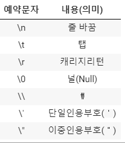
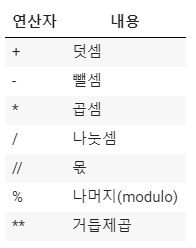
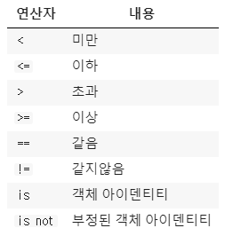
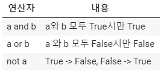
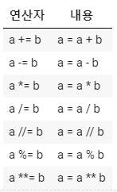
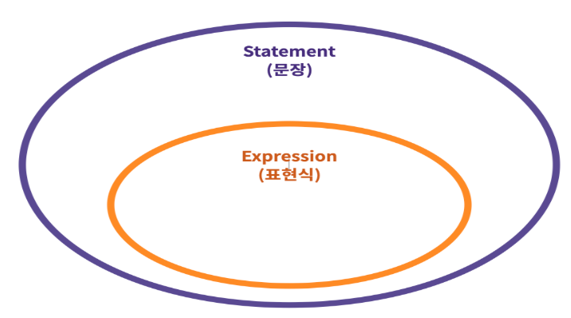

### 01. Python 기초

#### 1. Python 기초 문법

- https://www.python.org/dev/peps/pep-0008/

- 주석

  - 한 줄 주석은 #으로 표현

  - 여러 줄의 주석은 """ 또는 ''' (multiline string)으로 표현이 가능

    - ```python
      """
      이건
      여러줄에 걸쳐 쓸 수 있는
      주석입니다.
      """
      ```

  - 코드 라인

    - 파이썬 코드는 '1줄에 1문장'이 원칙

    - 문장은 파이썬이 실행 가능한 최소한의 코드 단위

    - 기본적으로 파이썬에서는 ;를 사용하지 않음

    - 한 줄로 표기할때는 ;를 사용하여 표기할 수 있음

    - ``` python
      print("hello");print('World')
      
      print('\
      안녕\
      나는\
      python이야\
      ')
      ```

    - [] {} () 는 \ 없이도 가능

#### 2. 변수

- 할당 연산자

  - 변수는 =을 통해 할당(assignment) 됨

  - 해당 데이터 타입을 확인하기 위해서는 type()을 활용

  - 해당 값의 메모리 주소를 확인하기 위해서는 id()를 활용

  - ```python
    # 같은 값을 두 변수에 동시에 할당 가능
    x=y='ssafy'
    # 변수 x와 y의 값을 바꿀 수 있음 
    a, b = 10, 20
    a, b = b, a
    ```

- 식별자(Identifiers)

  - 파이썬에서 식별자는 변수, 함수, 모듈, 클래스 등을 식별하는데 사용되는 이름

  - ``` python
    # 예약어들을 직접 확인해볼 수 있음
    import keyword
    print(keyword.kwlist)
    ```

  - 내장함수나 모듈 등의 이름으로 만들면 안됨

  - ```python
    print = 'ssafy'
    # print은 이제 'ssafy'라는 값으로 인식되기 때문에 이전의 기능을 수행하지 못합니다.
    print(print)
    
    # 뒤에서 진행될 코드에 영향이 갈 수 있기 때문에 방금 생성한 print를 삭제합니다.
    del print
    ```

#### 3. 데이터 타입(Data Type)

- 숫자(Number) 타입

  1. int (정수, integer)

     - 모든 정수는 int로 표현

     - python 3.x에서 long은 없어짐

     - 파이썬에서 가장 큰 숫자를 활용하기 위해 sys 모듈을 불러옴

     - 파이썬은 정수 자료형에서 오버플로우가 없음

     - ``` python
       # n진수 표현법
       
       binary_number =0b10
       print(binary_number)
       
       octal_number = 0o10
       print(octal_number)
       
       hectal_number = 0x10
       print(hectal_number)
       ```

     - ``` python
       # 가장 큰 수가 유동적으로 변함
       import sys
       print(sys.maxsize*sys.maxsize)
       ```

  2. float (부동소수점, 실수, floating point number)

     - 실수는 float으로 표현됨

     - 실수를 컴퓨터가 표현하는 과정에서 부동소수점을 사용하며, 항상 같은 값으로 일치되지 않음(floating point rounding error)

     - ```python
       # 실수의 연산
       3.5 - 3.2 == 0.3 #False
       round(3.5-3.2, 2) == 0.3 #True
       
       # sys 모듈을 통해 처리하는 법 : 'epsilon'은 부동소수점 연산에서 반올림 함으로써 발생하는 오차 상환
       a, b = 3.5, 3.2
       import sys
       abs(a-b) <= sys.float_info.epsilon #True
       
       # python 3.5부터 활용 가능한 math 모듈을 통해 처리할 수 있음
       import math
       math.isclose(a,b) #True
       ```

     - ```python
       # 컴퓨터식 지수 표현 방식 (e와 E 어느것을 사용해도 무방)
       b=314e-2
       print(b)
       ```

  3. complex (복소수, complex number)

     - 파이썬에서 복소수는 허수부를 j로 표현

     - ``` python
       a=3+4j
       # 문자열을 변환할 때, 문자열은 중앙의 + 또는 - 연산자 주위에 공백을 포함해서는 안 됨
       b = complex('3+4j') #가능
       c = complex('3 + 4j') #Error
       
       ```

#### 4. 문자(String) 타입

- 기본 활용법

  - 문자열은 Single quotes(')나 Double quotes(")을 활용하여 표현 가능

    - 작은 따옴표 : 큰 따옴표를 담을 수 있음
    - 큰 따옴표 : 작은 따옴표를 담을 수 있음
    - 삼중 따옴표 : ''' 세 개의 작은 따옴표''', """세 개의 작은 큰따옴표"""

  - ``` python
    # 사용자에게 받은 입력은 기본적으로 str
    number = input('숫자를 입력해주세요') # number은 str
    ```

- 따옴표 사용

  - 문자열 안에 문장부호(', ")가 사용될 경우 이스케이프 문자(\\)를 활용 가능

  - ``` python
    "he's cool"
    'he\'s cool'
    
    # 문자열은 + 연산자로 이어붙이고, * 연산자로 반복시킬 수 있음.
    'hello'+'ssafy'
    'hello '*3
    
    # 변수화해서도 사용가능.
    name = 'min'
    'my name is ' + name
    
    # 두 개 이상의 문자열이 연속해서 나타나면 자동으로 이어 붙여짐.
    'hello' 'ssafy'
    
    ```

- 이스케이프 시퀀스

  - 문자열을 활용하는 경우 특수문자 혹은 조작을 하기 위하여 사용되는 것으로 \를 활용하여 이를 구분함

  - 

  - ``` python
    # end 옵션은 이스케이프 문자열이 아닌 다른 것도 가능
    print('hello',end=' ')
    print('ssafy')
    ```

- String interpolation

  - %-formatting

    `print('내 이름은 %s 입니다.'%name)`

  - str.format()

    `print('내이름은 {} 입니다.'.format(name))`

  - f-string

    `print(f'내 이름은 {name} 입니다.')`

  - f-string에서는 형식을 지정할 수 있음

    ``` python
    # 다양한 형식을 활용하기 위해 datetime 모듈로 오늘을 표현
    import datetime
    now = datetime.datetime.now()
    print(now)
    
    # interpolation에서 출력형식을 지정할 수 있음\
    f'올해는 {now:%Y}년 이번달은 {now:%m}달 오늘은 {now:%d}일 입니다.'
    
    # string interpolation을 통해 출력형식 지정 뿐만 아니라, 연산도 가능
    pi = 3.141592
    r=10
    print(pi)
    print(f'{pi:.3} 넓이는 : {pi*r*r}')
    
    ```

#### 5. 참/거짓(Boolean) 타입

- 파이썬에는 True와 False로 이뤄진 bool 타입이 있음

- 비교/논리 연산을 수행 등에서 활용

- False로 변환되는 예

  `0, 0.0, (), [], {}, '', None`

- None 타입

  ``` python
  # 파이썬에서는 값이 없음을 표현하기 위해 None 타입이 존재
  
  bool(None) #False
  ```

#### 6. 형 변환(Type conversion, Typecasting)

- 파이썬에서 데이터타입은 서로 변환할 수 있음

  - 암시적 형변환(Implict Type Conversion)

    - 사용자가 의도하지 않았지만, 파이썬 내부적으로 자동으로 형변환 하는 경우

    - ```python
      # boolean과 integer는 더할 수 있을까?
      True + 3 #4
      # None과 integer은 더할 수 있을까?
      result = None
      result + 3 #Error
      
      # int, float, complex를 각각 변수에 대입
      int_num = 2020
      float_num = 3.14
      complex_num = 2 + 3j
      # int와 float를 더하면 그 결과의 type은?
      int_num + float_num #2023.14
      # int와 complex를 더하면 그 결과의 type은?
      int_num + complex_num #(2022+3j)
      
      # 더 복잡한 형태로 암시적 형변환이 일어남
      ```

  - 명시적 형변환(Explicit Type Conversion)

    - 위의 상황을 제외하고는 모두 명시적으로 형 변환을 해주어야함

      - string -> integer : 형식에 맞는 숫자만 가능
      - integer -> string : 모두 가능

    - 암시적 형변환이 되는 모든 경우도 명시적으로 형변환이 가능

      - int() : string, float를 int로 변환
      - float() : string, int를 float로 변환
      - str() : int, float, list, tuple, dictionary를 문자열로 변환

      ```python
      # string은 글자가 숫자일때만 형변환이 가능
      int('a') #Error
      # string 3.5를 int로 변환할 수는 없음
      int(float('3.5')) #3
      # float 3.5는 int로 변환이 가능
      int(3.5) #3
      ```

#### 7. 연산자(Operator)

- 산술 연산자

  - python에서는 기본적인 사칙연산이 가능

  - 

  - 나눗셈(/) 은 항상 float를 돌려줌

  - 정수 나눗셈으로(소수부 없이) 정수 결과를 얻으려면 // 연산자를 사용

  - ```python
    # /, //에 따라 type이 달라짐
    type(4/2) #float
    type(4//2) #int
    
    # divmod는 나눗셈과 관련된 함수
    a, b = divmod(5, 2) #(2, 1)
    
    # 음수 양수 표현도 가능
    num = 2020
    -num #-2020
    ```

- 비교 연산자

  - 수학에서 배운 연산자와 동일하게 값을 비교할 수 있음

  - 

  - ```python
    3 == 3.0 #True
    'ssafy' == 'ssafy' #True
    'ssafy' == 'Ssafy' #False
    ```

- 논리 연산자(매우 중요!!)

  - 

  - &, | 은 파이썬에서 비트 연산자

  - 단축평가

    - 첫 번째 값이 확실할 때, 두 번째 값은 확인하지 않음

    - 조건문에서 뒷 부분을 판단하지 않아도 되기 때문에 속도 향상

      ```python
      vowels = 'aeiou'
      ('a' and 'b') in vowels # b가 vowels에 있냐를 물으므로 False
      ('a' or 'b') in vowels # a가 vowels에 있냐를 물으므로 True
      
      ```

    - `and` 는 둘 다 True일 경우만 True이기 때문에 첫번째 값이 True라도 두번째 값을 확인해야 하기 때문에 'b'가 반환된다.

    - `or` 는 하나만 True라도 True이기 때문에 True를 만나면 해당 값을 바로 반환한다.

- 복합 연산자

  - 복합 연산자는 연산과 대입이 함께 이뤄짐

  - 

  - ```python
    # 복합 연산자 사용 예시
    cnt = 0
    while cnt < 5:
      print(cnt)
      cnt += 1
    ```

- 기타 주요 연산자

  - Concatenation

    - 숫자가 아닌 자료형은 + 연산자를 통해 합칠 수 있음

    - ``` python
      # 문자열을 더하기
      'hello ' + 'ssafy' #'hello ssafy'
      # list 더하기
      [1, 2, 3] + [4, 5, 6] #[1, 2, 3, 4, 5, 6]
      ```

  - Containment Test

    - in 연산자를 통해 요소가 속해있는지 여부를 확인할 수 있음

    - ```python
      # 문자열
      'a' in 'abc' #True
      # list
      1 in [1, 2, 3] #True
      # range
      1 in range(45) #True
      ```

  - Identity

    - is 연산자를 통해 동일한 것인지 확인할 수 있음

    - ```python
      # 파이썬에서 -5 부터 256 까지의 id는 동일
      print(id(5))
      id(6)
      
      # 257 이루의 id 는 다름
      a = [1, 2, 3]
      b = [1, 2, 3]
      print(a == b) #True
      print(a is b) #print(id(a) == id(b)) #False
      ```

  - Indexing/Slicing

    - []를 통한 값을 접근하고, [:]을 통해 리스트를 슬라이싱할 수 있음

    - ```python
      [1, 2, 3, 4, 5][1:3] #[2, 3]
      ```

#### 8. 연산자 우선순위

1. `()`을 통한 grouping
2. Slicing
3. Indexing
4. 제곱연산자 `**`
5. 단항연산자 `+`, `-` (음수/양수 부호)
6. 산술연산자 `*`, `/`, `%`
7. 산술연산자 `+`, `-`
8. 비교연산자, `in`, `is`
9. `not`
10. `and`
11. `or`

#### 9. 문장과 표현식의 관계



